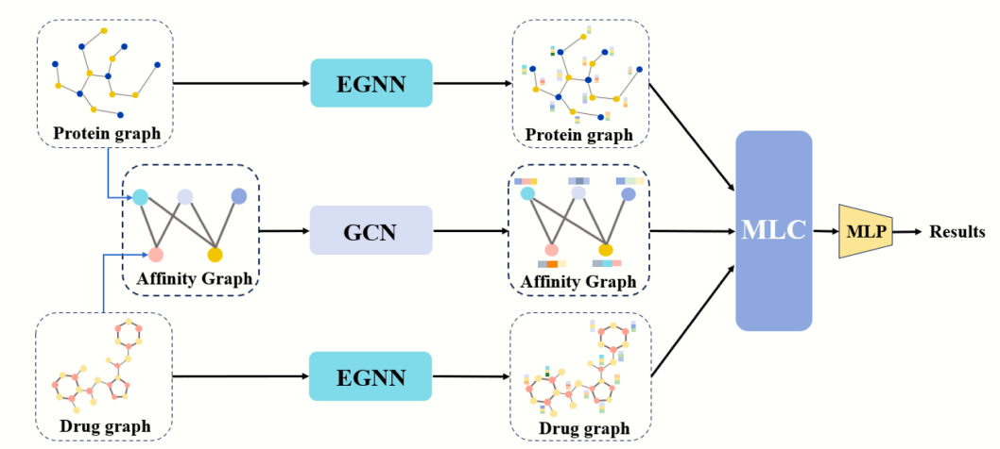

# MLC-DTA: Drug-target affinity prediction based on multi-level contrastive learning and equivariant graph neural networks

## Abstract
With the development of computer-aided drug design in the field of pharmaceutical research, drug-target affinity (DTA) prediction is of great significance for compound screening and drug development. Recent studies have widely adopted deep learning techniques for DTA prediction, focusing on feature extraction from sequences and graph structures. Despite progress, these methods often overlook interaction relationships at the network level. Moreover, graph-based molecular representation methods relying on graph neural networks (GNNs) fail to incorporate 3D molecular structural information, limiting their potential for DTA prediction. To overcome these issues, we propose MLC-DTA, a computational method specifically designed for drug-target affinity prediction tasks. MLC-DTA uses equivariant graph neural networks to extract the structural features of drugs and targets, retaining the geometric equivariance of proteins while capturing the specific structural information of drug molecules. In addition, it integrates the interaction relationships between drugs and targets to obtain the network-level features, understanding the DTA interactions from multiple perspectives of molecules and networks. Finally, a contrastive learning strategy is introduced to maximize mutual information at both the molecular and network levels, thereby improving the prediction performance. Comparative experiments and case analyses on two datasets show that MLC-DTA has a significant improvement in accuracy.

<div align=center>

</div>

## Preparation
### Environment Setup
The repo mainly requires the following packages.
+ torch
+ torch_geometric
+ torch_scatter
+ torch_sparse
+ dgl
+ numpy
+ pandas
+ scikit-learn
+ scipy
+ seaborn
+ rdkit
+ networkx

## Experimental Procedure
### Create Dataset
run the script below to prepare target molecule graphs and drug molecule graphs.

```python 
python3 data_process_egnn.py 
```

### Model Training and Testing
Run the following script to train and test the model.
```python
python3 inference_egnn_new.py
```

